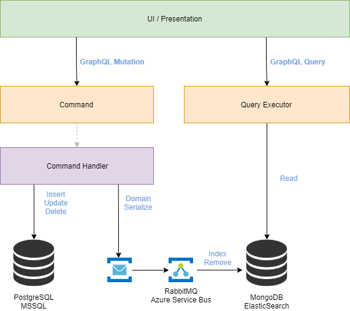

# GraphAPI

[](https://ci.appveyor.com/project/gbauso/graphapi/branch/develop)
[](https://www.codefactor.io/repository/github/gbauso/graphapi)

[](https://ci.appveyor.com/project/gbauso/graphapi/branch/develop)

This project is an experimental proof of concept which exposes a GraphQL API.\
It consists on a task manager, including User, Project and Task management.\
There is inspiration on DDD, Hexagonal Architecture and CQRS.

## Architecture



## Schema

```graphql
schema {
  query: query
  mutation: mutation
}
```

### Queries

```graphql
type query {
  
  user(id: String!): UserType
  users(
    pagination: PaginationType!
    order: String = null
    filter: UserFilterType = null
  ): [UserType]
  
  project(id: String!): ProjectType
  projects(
    pagination: PaginationType!
    order: String = null
    filter: ProjectFilterType = null
  ): [ProjectType]
  
  task(id: String!): TaskType
  tasks(
    pagination: PaginationType!
    order: String = null
    filter: TaskFilterType = null
  ): [TaskType]
}
```

### Mutation

```graphql
type mutation {

  addUser(data: UserInput!): MutationResultType
  editUserInfo(data: UserInput!): MutationResultType
  
  addProject(data: AddProjectInput!): MutationResultType
  addUserProject(data: UserProjectInput!): MutationResultType
  removeUserProject(data: UserProjectInput!): MutationResultType
  updateProjectInfo(data: UpdateDescriptionInput!): MutationResultType
  
  addTask(data: AddTaskInput!): MutationResultType
  changeAssignee(data: ChangeAssigneeInput!): MutationResultType
  updateTaskInfo(data: UpdateDescriptionInput!): MutationResultType
  updateDeadline(data: UpdateDeadlineInput!): MutationResultType
  updateTaskStatus(data: UpdateTaskStatusInput!): MutationResultType
}
```

### Types

#### Filter
```graphql
input FilterType {
  operation: String!
  value: String!
}

input DateFilterType {
  operation: String!
  value: String!
}

input EnumFilterType {
  operation: String!
  value: TaskStatusEnum = null
}

input UserFilterType {
  name: FilterType = null
  email: FilterType = null
}

input ProjectFilterType {
  description: FilterType = null
  longDescription: FilterType = null
}

input TaskFilterType {
  description: FilterType = null
  deadLine: DateFilterType = null
  assignee: FilterType = null
  reporter: FilterType = null
  status: EnumFilterType = null
}
```
#### Mutation Inputs
```graphql
input UserInput {
  id: String = null
  name: String!
  email: String!
}

input AddProjectInput {
  description: String!
  longDescription: String = null
}
input UserProjectInput {
  projectId: ID = null
  userId: ID = null
}

input AddTaskInput {
  description: String!
  longDescription: String!
  deadLine: Date!
  projectId: String = null
  reporterId: String = null
  assigneeId: String = null
}
input ChangeAssigneeInput {
  id: String = null
  newAssigneeId: String = null
}
input UpdateDeadlineInput {
  id: String = null
  deadline: Date!
}
input UpdateTaskStatusInput {
  id: String = null
  status: TaskStatusEnum = null
}


input UpdateDescriptionInput {
  id: ID = null
  description: String = null
  longDescription: String = null
}
```

#### Query Inputs
```graphql
input PaginationType {
  skip: Int!
  take: Int!
}

enum TaskStatusEnum {
  BACKLOG
  IN_PROGRESS
  TESTING
  DONE
}
```
#### Query Result
```graphql
type UserType {
  email: String!
  id: String!
  name: String!
  projects: [UserProjectType]
}
type UserProjectType {
  description: String!
  id: String!
  longDescription: String!
}

type ProjectType {
  description: String!
  finishedCount: Int!
  id: String!
  longDescription: String
  participants: [ProjectUserType]
  tasks: [ProjectTaskType]
  unfinishedCount: Int!
}
type ProjectUserType {
  id: String!
  name: String!
}
type ProjectTaskType {
  description: String!
  id: String!
  responsible: String!
  status: String!
}

type TaskType {
  assignee: TaskUserType
  createdDate: Date
  deadline: Date
  description: String!
  id: String!
  longDescription: String
  project: TaskProjectType
  reporter: TaskUserType
  status: String!
}
type TaskUserType {
  id: String!
  name: String!
}
```

### Tech

GraphAPI uses a number of open source projects and tools to work properly:

* [.NET Core 3.0]()
* [ASP NET Core 3.0]() 
* [Entity Framework Core 3.0]() 
* [GraphQL](https://github.com/graphql-dotnet) 
* [GraphQL Playground](https://github.com/graphql-dotnet/server) 
* [MassTransit](https://github.com/MassTransit/MassTransit) 
* [Automapper](https://github.com/AutoMapper/AutoMapper)
* [MediatR](https://github.com/jbogard/MediatR)
* [RabbitMQ]() - Default
* [Azure Service Bus]() - Optional
* [MongoDB]() - Default
* [PostgreSQL]() - Default
* [Microsoft SQL Server]() - Optional
* [Docker]()

 
##### Soon
* [ElasticSearch]() 
* [Kubernetes]() 

### Installation

GraphAPI can be started using Visual Studio or dotnet CLI with a properly stack configuration on appSettings.json.
There is, also, a docker compose file with the full stack ready to be started.

```sh
$ cd {ROOT_PROJECT}
$ docker-compose -f docker-compose-stack.yml up -d 
```

##### Docker Compose
By default the ports 27017 (MongoDB), 5432(PostgreSQL), 5672(RabbitMQ), 5017(HTTPS, requires SSL certificate), 5016 (HTTP) will be assigned.

```sh
$ cd {ROOT_PROJECT}
$ docker-compose up -d
```

Then, open it on <http://localhost:5006/ui/playground> or <https://localhost:5007/ui/playground> (if you configured HTTPS) and enjoy.

### Development

Want to contribute? Great!

Start development on this project is simple, just open it on VSCode, Visual Studio or your preferred IDE and start to develop. 

### Todos

 - Add Codecoverage badge using Codecov
 - Write MORE Tests
 - Implement Elastic Search Manager
 - Kubernetes Implementation
 - Add Notes on Tasks

License
----

MIT
